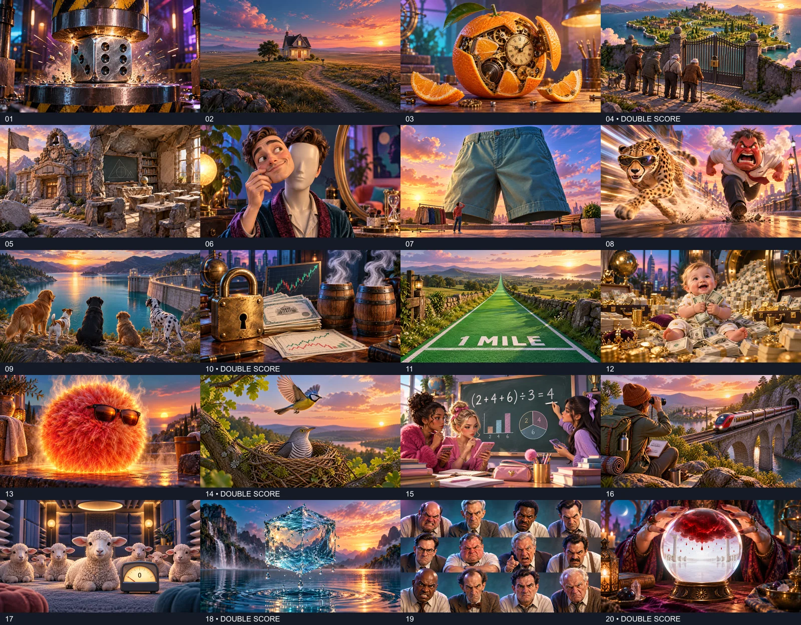

# Literal Movie Titles

20 colourful 3D editorial visual riddles, numbered in quiz order. Each PNG is 1600 × 900 (16:9) and below Katwed's 8 MB upload limit.

Generated and refined using the built-in `image_gen` tool. The complete generation and correction prompts are in [prompts.json](prompts.json); dimensions and byte sizes are in [image-manifest.json](image-manifest.json).

## Preview

## Use in Katwed

Upload the numbered PNGs through each question's image control in the quiz editor, then save the quiz. Enable **Double Score** for questions **04, 10, 14, 18 and 20**. These are authoring instructions; image files cannot configure scoring.

This pack is repository artwork for manual authoring. It does not create or alter a live quiz, deploy the frontend or change the database. Answer-bearing filenames and these host notes must not be used as player-facing media URLs or alt text. Normal Katwed uploads use generated Storage filenames; use neutral player-facing alt text such as “Literal film-title visual clue”.

## Host answer key

| Question image | Answer | Double Score |
|---|---|---|
| [01-die-hard.png](01-die-hard.png) | Die Hard | — |
| [02-home-alone.png](02-home-alone.png) | Home Alone | — |
| [03-a-clockwork-orange.png](03-a-clockwork-orange.png) | A Clockwork Orange | — |
| [04-no-country-for-old-men.png](04-no-country-for-old-men.png) | No Country for Old Men | Yes |
| [05-school-of-rock.png](05-school-of-rock.png) | School of Rock | — |
| [06-face-off.png](06-face-off.png) | Face/Off | — |
| [07-the-big-short.png](07-the-big-short.png) | The Big Short | — |
| [08-the-fast-and-the-furious.png](08-the-fast-and-the-furious.png) | The Fast and the Furious | — |
| [09-reservoir-dogs.png](09-reservoir-dogs.png) | Reservoir Dogs | — |
| [10-lock-stock-and-two-smoking-barrels.png](10-lock-stock-and-two-smoking-barrels.png) | Lock, Stock and Two Smoking Barrels | Yes |
| [11-the-green-mile.png](11-the-green-mile.png) | The Green Mile | — |
| [12-million-dollar-baby.png](12-million-dollar-baby.png) | Million Dollar Baby | — |
| [13-hot-fuzz.png](13-hot-fuzz.png) | Hot Fuzz | — |
| [14-one-flew-over-the-cuckoos-nest.png](14-one-flew-over-the-cuckoos-nest.png) | One Flew Over the Cuckoo's Nest | Yes |
| [15-mean-girls.png](15-mean-girls.png) | Mean Girls | — |
| [16-trainspotting.png](16-trainspotting.png) | Trainspotting | — |
| [17-the-silence-of-the-lambs.png](17-the-silence-of-the-lambs.png) | The Silence of the Lambs | — |
| [18-the-shape-of-water.png](18-the-shape-of-water.png) | The Shape of Water | Yes |
| [19-12-angry-men.png](19-12-angry-men.png) | 12 Angry Men | — |
| [20-there-will-be-blood.png](20-there-will-be-blood.png) | There Will Be Blood | Yes |

## Review

All images were visually reviewed for the intended literal clue. Question 10 has exactly two smoking barrels; question 14 has one flying bird above a cuckoo in its nest; question 19 has exactly twelve men in four columns and three rows. Question 15 uses the correct mean equation `(2 + 4 + 6) ÷ 3 = 4`. Unwanted written signs were removed from questions 05 and 07. Question 20 shows red liquid suspended above a clean white floor inside the prediction, without injury or gore.
